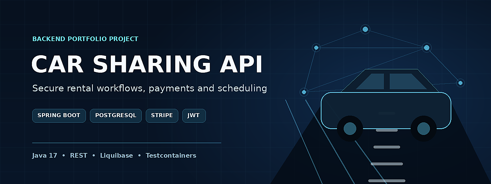
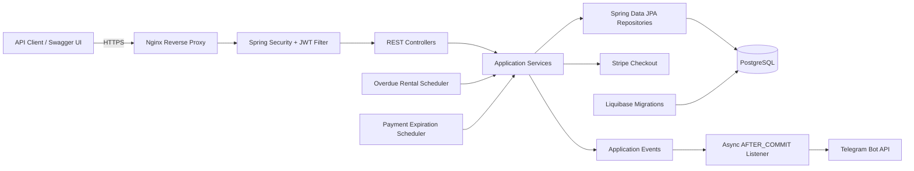
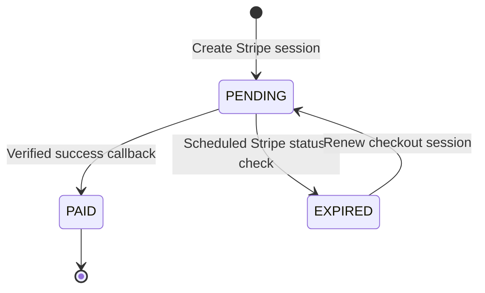

# CarSharingApp

A Spring Boot REST API that implements the complete car-rental workflow: inventory-safe booking and returns, JWT authorization, Stripe payment sessions, overdue processing, and transaction-aware Telegram notifications. The application is publicly deployed on AWS EC2 behind Nginx with HTTPS.

[](https://openjdk.org/projects/jdk/17/)
[](https://spring.io/projects/spring-boot)
[](https://www.postgresql.org/)
[](#testing-strategy)

[Live Swagger UI](https://portfolio-carsharing.duckdns.org/api/swagger-ui) · [Health Check](https://portfolio-carsharing.duckdns.org/api/health)

[Architecture](#architecture) · [Engineering Highlights](#engineering-highlights) · [API Documentation](#api-documentation) · [Run Locally](#running-locally) · [Testing](#testing-strategy)

## Key Features

- **Inventory-safe rentals** — reserves a car with one conditional database update, preventing inventory from dropping below zero.
- **Controlled rental returns** — locks the rental row with `PESSIMISTIC_WRITE`, rejects duplicate returns, and restores inventory in the same transaction.
- **JWT security and role-based access** — stateless authentication, BCrypt password hashing, and method-level rules for `CUSTOMER` and `MANAGER`.
- **Stripe payment lifecycle** — creates `PAYMENT` and `FINE` checkout sessions, confirms successful payments, detects expiration, and renews expired sessions.
- **Business-rule enforcement** — blocks new rentals while the customer has a `PENDING` or `EXPIRED` payment.
- **Reliable external notifications** — sends Telegram messages asynchronously only after the surrounding database transaction commits.
- **Automated quality controls** — Liquibase migrations, PostgreSQL Testcontainers, MockMvc integration tests, Mockito unit tests, Checkstyle, JaCoCo gates, and GitHub Actions.
- **Public AWS deployment** — runs on an AWS EC2 instance through Docker Compose, with Nginx as a reverse proxy and HTTPS certificates managed by Let's Encrypt.

## Tech Stack

| Area | Technologies |
|---|---|
| Language and framework | Java 17, Spring Boot 4.0.6, Spring Web MVC |
| Persistence | Spring Data JPA, Hibernate, PostgreSQL 15, Liquibase |
| Security | Spring Security, JWT with JJWT 0.12.6, BCrypt |
| Payments and messaging | Stripe Java 33.1.0, Telegram Bot API, Spring application events |
| API and mapping | REST, Bean Validation, springdoc OpenAPI 3.0.2, MapStruct 1.5.5 |
| Testing and quality | JUnit 5, Mockito, MockMvc, Testcontainers 1.19.8, AssertJ, JaCoCo 0.8.15, Checkstyle |
| Delivery | Maven Wrapper, Docker, Docker Compose, GitHub Actions, AWS EC2, Nginx, Let's Encrypt, DuckDNS |

## Architecture



The application is a layered monolith. Controllers own HTTP concerns, services enforce business rules and transaction boundaries, repositories isolate persistence, and adapters handle Stripe and Telegram communication.

## Core Business Flow

1. A user registers or logs in and receives a JWT.
2. Public catalog endpoints expose available cars; catalog mutations require the `MANAGER` role.
3. A `CUSTOMER` creates a rental.
- Existing unpaid payments are checked first.
- Inventory is decremented atomically only when stock is greater than zero.
4. A customer or manager returns the rental.
- The rental row is locked for update.
- Repeated returns are rejected.
- The actual return date is recorded and inventory is restored.
5. The customer creates either a regular rental payment or an overdue fine.
6. Stripe hosts the checkout session.
- A successful callback is verified against Stripe before the payment becomes `PAID`.
- A scheduler marks expired checkout sessions as `EXPIRED`.
- Only expired sessions can be renewed.
7. Rental and payment events publish Telegram notifications after a successful commit.

## Engineering Highlights

| Problem | Implementation | Why it matters |
|---|---|---|
| Two requests can try to reserve the last car simultaneously. | `UPDATE ... SET inventory = inventory - 1 WHERE inventory > 0` returns the affected-row count. | Availability is checked and changed atomically instead of using a race-prone read-then-write sequence. |
| The same rental can be returned twice by concurrent requests. | The return flow loads the rental with `PESSIMISTIC_WRITE` and checks `actualReturnDate` before restoring inventory. | Serializes competing returns and protects inventory consistency. |
| Remote Stripe calls can keep database transactions open. | `TransactionTemplate` separates database preparation, Stripe session creation, and payment persistence into distinct steps. | Remote I/O runs outside a long-lived database transaction, reducing lock time and connection usage. |
| Stripe can create a session while local persistence fails. | The service attempts to expire the newly created Stripe session when saving the local payment fails. | Reduces orphaned checkout sessions and keeps external and internal state closer together. |
| Notifications should not announce rolled-back operations. | Events are handled by an asynchronous `AFTER_COMMIT` transactional listener. | Telegram receives only committed business events, while API latency is not tied to notification delivery. |
| External status checks can fail independently. | Payment-expiration processing catches gateway failures per payment and continues processing the remaining records. | One unavailable Stripe lookup does not abort the entire scheduled batch. |
| Deleted catalog entries should remain auditable. | Cars use Hibernate `@SQLDelete` and `@SQLRestriction` for soft deletion. | Normal reads exclude deleted cars without physically removing their rows. |

## Security

The API uses stateless Spring Security with a custom JWT filter inserted before `UsernamePasswordAuthenticationFilter`.

| Access level | Capabilities |
|---|---|
| Public | Registration, login, car reads, health check, Swagger/OpenAPI, Stripe success and cancel callbacks |
| `CUSTOMER` | Create rentals, create payment sessions, renew expired sessions, read own rentals and payments |
| `MANAGER` | Create, update, and soft-delete cars; inspect rental and payment data |
| `CUSTOMER` or `MANAGER` | Read and return rentals, with customer ownership enforced in the service layer |

Additional controls:

- Passwords are hashed with BCrypt.
- Customers cannot select another user's rentals or payments by passing a different `user_id`.
- Access to another customer's rental or payment is returned as not found rather than exposing resource existence.
- Request DTOs use Jakarta Bean Validation.

## Payments Lifecycle



Two calculation strategies are supported:

- `PAYMENT` — the regular rental charge.
- `FINE` — an overdue charge using the configurable `FINE_MULTIPLIER`.

Amounts are rounded to two decimal places before a checkout session is created. New rentals are blocked while the authenticated customer has a payment in `PENDING` or `EXPIRED` state.

## Scheduled Processing

| Job | Schedule | Behavior |
|---|---|---|
| Overdue rental processing | Daily at `00:00` | Finds active rentals whose return date has passed and publishes notification events |
| Payment expiration processing | Every minute | Checks `PENDING` Stripe sessions and marks expired ones as `EXPIRED` |

Both jobs are enabled only when `SCHEDULING_ENABLED=true`.

## Testing Strategy

The test suite covers the system at multiple boundaries:

- **Unit tests** isolate services, calculators, schedulers, security components, and external gateways with Mockito.
- **Repository tests** exercise JPA queries, filters, locking-related persistence behavior, and atomic inventory updates.
- **Controller integration tests** boot the Spring context and use MockMvc with Spring Security.
- **Authorization tests** cover public, unauthenticated, customer, manager, and cross-user access scenarios.
- **Database integration** runs against PostgreSQL 15 through the Testcontainers JDBC driver.
- **External integrations** are isolated: the Stripe gateway is mocked in integration tests, while Telegram notifications are disabled by test configuration.
- **Build gates** run Checkstyle and enforce at least 80% line coverage and 70% branch coverage during Maven `verify`.

Coverage snapshot from the supplied JaCoCo report, after the configured exclusions for DTOs, model classes, and generated MapStruct implementations:

| Metric | Covered | Coverage |
|---|---:|---:|
| Lines | 618 / 645 | **95.8%** |
| Branches | 78 / 78 | **100%** |
| Instructions | 2,517 / 2,608 | **96.5%** |
| Methods | 167 / 178 | **93.8%** |
| Classes | 60 / 61 | **98.4%** |

Run the complete quality pipeline with:

```bash
./mvnw verify
```

On Windows:

```powershell
.\mvnw.cmd verify
```

## API Documentation

The portfolio deployment is publicly available at:

- Swagger UI: https://portfolio-carsharing.duckdns.org/api/swagger-ui
- OpenAPI JSON: https://portfolio-carsharing.duckdns.org/api/v3/api-docs
- Health check: https://portfolio-carsharing.duckdns.org/api/health

For a local instance:

- Swagger UI: `http://localhost:8080/api/swagger-ui`
- OpenAPI JSON: `http://localhost:8080/api/v3/api-docs`
- Health check: `http://localhost:8080/api/health`

Swagger and OpenAPI routes are public so the API can be explored without first obtaining a token. Protected operations can be called from Swagger UI with a JWT bearer token.

### Main Resources

| Resource | Purpose |
|---|---|
| `/api/auth` | Registration and login |
| `/api/cars` | Public catalog reads and manager-only catalog mutations |
| `/api/rentals` | Rental creation, filtering, lookup, and return |
| `/api/payments` | Payment lookup, Stripe session creation, callbacks, and renewal |
| `/api/users` | User profile operations |
| `/api/health` | Lightweight application health response |

## Running Locally

### 1. Clone and configure the project

Requirements:

- Git
- Docker with Docker Compose
- Stripe test-mode secret key
- Java 17 only when running the application through Maven

Clone the repository and enter the project directory:

```bash
git clone https://github.com/Krupkolllia/car-sharing-app.git
cd car-sharing-app
```

Create a local environment file from the provided template:

```bash
cp .env.sample .env
```

On Windows PowerShell:

```powershell
Copy-Item .env.sample .env
```

Set at least these values in `.env`:

```dotenv
POSTGRES_USER=carsharing
POSTGRES_PASSWORD=change-me
POSTGRES_DB=carsharing
SPRING_DOCKER_PORT=8080

JWT_SECRET=<Base64-encoded-256-bit-secret>
STRIPE_SECRET_KEY=sk_test_...

TELEGRAM_NOTIFICATIONS_ENABLED=false
SCHEDULING_ENABLED=false
```

Generate a suitable development JWT secret:

```bash
openssl rand -base64 32
```

### 2. Start the application

#### Docker Compose — recommended

Build and start the application together with PostgreSQL:

```bash
docker compose up --build
```

The API will be available at `http://localhost:8080/api`, and PostgreSQL will be exposed on local port `5433` by the sample configuration.

Stop the stack:

```bash
docker compose down
```

To also remove the PostgreSQL volume:

```bash
docker compose down -v
```

#### Maven with Dockerized PostgreSQL

Start only PostgreSQL:

```bash
docker compose up -d db
```

Run the application:

```bash
./mvnw spring-boot:run
```

On Windows:

```powershell
.\mvnw.cmd spring-boot:run
```

## Configuration

| Variable | Required | Purpose | Sample default |
|---|---:|---|---|
| `POSTGRES_USER` | Yes | PostgreSQL username | — |
| `POSTGRES_PASSWORD` | Yes | PostgreSQL password | — |
| `POSTGRES_DB` | Yes | PostgreSQL database | — |
| `POSTGRES_LOCAL_PORT` | Yes | Host database port | `5433` |
| `POSTGRES_DOCKER_PORT` | Yes | Container database port | `5432` |
| `SPRING_LOCAL_PORT` | Yes | Host API port in Compose | `8080` |
| `SPRING_DOCKER_PORT` | Yes for Compose | Container API port | — (set to `8080`) |
| `LIQUIBASE_CONTEXTS` | Yes | Active Liquibase contexts | `dev` |
| `JWT_SECRET` | Yes | Base64-encoded JWT signing key | — |
| `JWT_EXPIRATION` | Yes | Token lifetime in milliseconds | `86400000` |
| `STRIPE_SECRET_KEY` | Yes | Stripe test or live secret key | — |
| `FINE_MULTIPLIER` | No | Overdue payment multiplier | `1.3` |
| `TELEGRAM_BOT_TOKEN` | When enabled | Telegram bot token | — |
| `TELEGRAM_CHAT_ID` | When enabled | Notification chat | — |
| `TELEGRAM_NOTIFICATIONS_ENABLED` | No | Enable Telegram listener | `false` |
| `APP_BASE_URL` | No | Base URL used in external callbacks | `http://localhost:8080/api` locally; `https://portfolio-carsharing.duckdns.org/api` in the deployed environment |
| `SCHEDULING_ENABLED` | No | Enable scheduled jobs | `false` |

Do not commit `.env` or real credentials.

## Database Migrations

Liquibase owns the schema and Hibernate runs with `ddl-auto=validate`. The `dev` context inserts development users; production-like environments should use an appropriate context instead of loading development data.

## Project Structure

```text
src/
├── main/
│   ├── java/org/project/carsharingapp/
│   │   ├── config/                  # Security, OpenAPI, async, clock and integration config
│   │   ├── controller/              # REST endpoints
│   │   ├── dto/                     # API contracts
│   │   ├── exception/               # Domain exceptions and global handlers
│   │   ├── mapper/                  # MapStruct mappers
│   │   ├── model/                   # JPA entities and enums
│   │   ├── repository/              # Spring Data repositories and custom queries
│   │   ├── security/                # JWT authentication and authorization
│   │   ├── service/                 # Rental, catalog and user business logic
│   │   └── service/payment/         # Stripe lifecycle and calculation strategies
│   └── resources/
│       └── db/changelog/            # Liquibase migrations
└── test/                             # Unit, repository and MockMvc integration tests

.github/workflows/ci.yml              # Maven verify on pushes and pull requests
docker-compose.yml                    # Application and PostgreSQL services
Dockerfile                            # Multi-stage, non-root runtime image
```

## Current Scope

This repository demonstrates backend design, testing, and deployment decisions; it does not claim commercial production operation. A public portfolio instance runs on AWS EC2 through Docker Compose, with Nginx terminating HTTPS and proxying requests to the application. The application port is bound to localhost on the server, PostgreSQL is not exposed publicly, and the API is available through the DuckDNS domain linked above.
